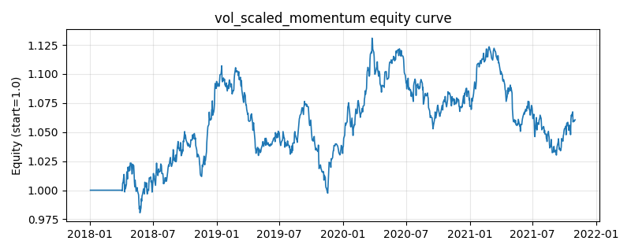

# 策略研究记录：vol_scaled_momentum

> 类别/途径：**volatility** ｜ 类型：timing ｜ 方向：只做多

## 一句话思路
时序动量（跳过最近数期）为正的资产才持有，权重按已实现波动倒数分配（波动越大仓位越小），总敞口 = 正动量资产占比。

## 收集途径 / 灵感来源
时序动量 (time-series momentum) + 波动率缩放 (inverse-vol weighting) 的组合范式（本仓库原创实现）。

## 核心假设
核心假设：动量信号的风险调整强度与波动成反比——同样的涨幅，低波动资产更可能来自持续性资金流而非噪声，因此按 1/vol 加权近似最大化组合 Sharpe（等风险贡献的简化版）；总敞口用「正动量资产占比」(breadth) 决定，等价于在市场普跌时自动降仓（绝对动量过滤）。失效场景：低波动资产同时缺乏弹性时会跑输等权；高波动急跌后的反弹被系统性低配；breadth 项在震荡市中会频繁改变总敞口，增加换手。

## 参数
- `mom_window` = 60
- `skip` = 5
- `vol_window` = 20
- `vol_floor` = 0.05

## 实现要点
- 实现文件：`kairos_strategies/channels/volatility.py`（类名对应本策略）。
- 输出统一为「目标权重面板」(date × asset)，由 `Backtester` 滞后一期执行，杜绝未来函数。
- 仅使用 numpy/pandas，离线、确定性。

## 数据与回测设置
| 项 | 值 |
|---|---|
| 数据集 | synthetic（8 资产） |
| 区间 | 2018-01-02 ~ 2021-11-01 |
| 期数 | 1000 |
| 年化基准期数 | 252 |
| 单边成本率 | 0.0500% |
| 无风险利率 | 0.00% |

## 回测结果
| 指标 | 值 |
|---|---|
| 累计收益 | 6.06% |
| 年化收益 (CAGR) | 1.49% |
| 年化波动 | 5.91% |
| 夏普 | 0.2803 |
| 索提诺 | 0.4084 |
| 最大回撤 | 9.90% |
| 卡玛 | 0.1508 |
| 胜率 | 50.80% |
| 盈利因子 | 1.0479 |
| 平均换手 | 0.0731 |
| 累计换手 | 73.06 |

## 净值曲线

## 结论与改进方向
- 结果为 **合成数据演示，用于验证实现正确性与 QR 流程**，不构成任何投资建议或收益承诺。
- 改进方向：在真实数据上重跑、参数敏感性分析、加入波动率目标/风控叠加、与其它策略做相关性分散。
