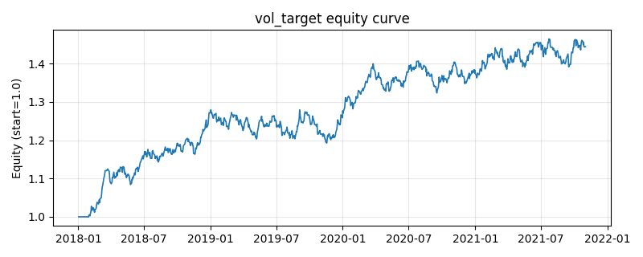

# 策略研究记录：vol_target

> 类别/途径：**volatility** ｜ 类型：overlay ｜ 方向：只做多

## 一句话思路
对等权组合做波动率目标：按 目标波动/已实现波动 缩放总敞口，高波降仓、低波满仓，缩放上限 1（不加杠杆）。

## 收集途径 / 灵感来源
风险管理范式——volatility targeting / 风险预算的总敞口缩放（本仓库原创实现）。

## 核心假设
核心假设：波动率具有强聚集性与可预测性，且高波动期单位风险收益更差（杠杆效应、被迫去杠杆与流动性收缩）。把组合波动锁定在目标水平可显著降低尾部回撤、改善 Sharpe；当目标波动高于市场已实现波动时策略退化为等权持有（不加杠杆），因此牛市低波阶段不占优；在波动骤升后快速回落的 V 型反转中会因滞后而踏空反弹。

## 参数
- `window` = 20
- `target_vol` = 0.12
- `max_scale` = 1.0
- `min_scale` = 0.0
- `vol_floor` = 0.01

## 实现要点
- 实现文件：`kairos_strategies/channels/volatility.py`（类名对应本策略）。
- 输出统一为「目标权重面板」(date × asset)，由 `Backtester` 滞后一期执行，杜绝未来函数。
- 仅使用 numpy/pandas，离线、确定性。

## 数据与回测设置
| 项 | 值 |
|---|---|
| 数据集 | synthetic（8 资产） |
| 区间 | 2018-01-02 ~ 2021-11-01 |
| 期数 | 1000 |
| 年化基准期数 | 252 |
| 单边成本率 | 0.0500% |
| 无风险利率 | 0.00% |

## 回测结果
| 指标 | 值 |
|---|---|
| 累计收益 | 44.44% |
| 年化收益 (CAGR) | 9.71% |
| 年化波动 | 8.46% |
| 夏普 | 1.1374 |
| 索提诺 | 1.6919 |
| 最大回撤 | 6.80% |
| 卡玛 | 1.4277 |
| 胜率 | 52.60% |
| 盈利因子 | 1.1982 |
| 平均换手 | 0.0118 |
| 累计换手 | 11.81 |

## 净值曲线

## 结论与改进方向
- 结果为 **合成数据演示，用于验证实现正确性与 QR 流程**，不构成任何投资建议或收益承诺。
- 改进方向：在真实数据上重跑、参数敏感性分析、加入波动率目标/风控叠加、与其它策略做相关性分散。
