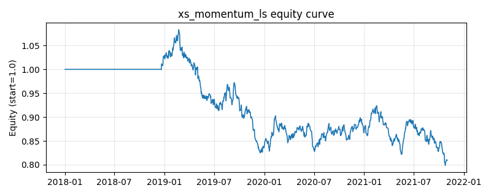

# 策略研究记录：xs_momentum_ls

> 类别/途径：**long_short** ｜ 类型：cross_section ｜ 方向：可多空

## 一句话思路
截面动量多空(12-1)：按 t-lookback 至 t-skip 的累计收益给全 universe 截面排序，做多最强 top 分位一篮子、做空最弱 bottom 分位一篮子，两腿等权各占 0.5 预算，组合逐行权重和恒 ≈ 0（美元中性、毛敞口 = 1）。

## 收集途径 / 灵感来源
多空股票 alpha 经典范式——横截面动量 (Jegadeesh-Titman 12-1 风格) 的市场中性版本，本仓库原创实现；与 momentum 渠道的 xs_momentum（只做多 top 1/3）不同，此处补上做空 bottom 分位的另一条腿，且排序/配权工具函数均在本模块内自实现。

## 核心假设
成因：信息扩散有滞后，投资者对特质信息先反应不足（强势延续）、对代表性证据又过度外推，使 3~12 个月的相对强弱有延续性；同时做多强者、做空弱者能把「强势延续」与「弱势续差」两段价差一起赚到手，且美元中性构造剥离了市场 beta，收益主要来自截面离散度而非大盘方向。失效条件：动量崩溃——暴跌后的 V 型反弹里前期最弱篮子弹性最大，空头腿与多头腿同时受损；风格急切换或流动性冲击使截面相关性骤升、离散度消失；排序被单一事件驱动的价格跳变主导，或策略拥挤后 alpha 被提前交易掉。

## 参数
- `lookback` = 252
- `skip` = 21
- `top_frac` = 0.3333333333333333
- `leg_budget` = 0.5

## 实现要点
- 实现文件：`kairos_strategies/channels/long_short.py`（类名对应本策略）。
- 输出统一为「目标权重面板」(date × asset)，由 `Backtester` 滞后一期执行，杜绝未来函数。
- 仅使用 numpy/pandas，离线、确定性。

## 数据与回测设置
| 项 | 值 |
|---|---|
| 数据集 | synthetic（8 资产） |
| 区间 | 2018-01-02 ~ 2021-11-01 |
| 期数 | 1000 |
| 年化基准期数 | 252 |
| 单边成本率 | 0.0500% |
| 无风险利率 | 0.00% |

## 回测结果
| 指标 | 值 |
|---|---|
| 累计收益 | -19.06% |
| 年化收益 (CAGR) | -5.19% |
| 年化波动 | 8.45% |
| 夏普 | -0.5885 |
| 索提诺 | -0.7984 |
| 最大回撤 | 26.30% |
| 卡玛 | -0.1974 |
| 胜率 | 48.40% |
| 盈利因子 | 0.8993 |
| 平均换手 | 0.0667 |
| 累计换手 | 66.69 |

## 净值曲线

## 结论与改进方向
- 结果为**合成数据上的演示**，用于验证实现正确性与 QR 流程，不构成任何投资建议或收益承诺。
- 改进方向：在真实数据上重跑、参数敏感性分析、加入波动率目标/风控叠加、与其它策略做相关性分散。
