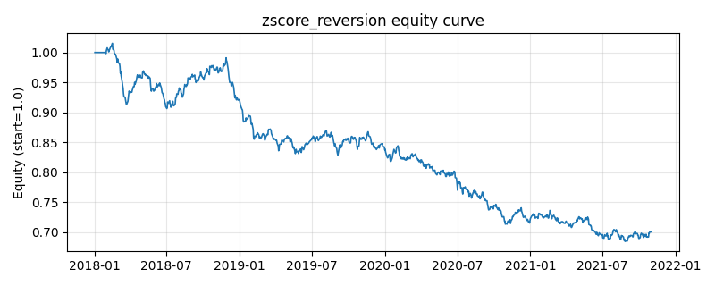

# 策略研究记录：zscore_reversion

> 类别/途径：**meanrev** ｜ 类型：timing ｜ 方向：可多空

## 一句话思路
滚动 z-score 回归：对数价格相对 N 期均值偏离 z < -阈值做多、z > +阈值做空，|z| 收敛到中枢附近平仓（三态滞后带）。

## 收集途径 / 灵感来源
统计套利经典范式——时序 z-score 均值回归（本仓库原创实现，指标复用自研 indicators.rolling_zscore）。

## 核心假设
核心假设：无漂移或弱漂移品种的价格围绕中枢震荡，标准化偏离越极端、回归概率越高，故反向持仓期望为正。失效场景：强趋势/结构性位移（如趋势品种持续单边），z 长期停留在极端区，逆势持仓被反复止损。

## 参数
- `window` = 20
- `entry_z` = 1.5
- `exit_z` = 0.5

## 实现要点
- 实现文件：`kairos_strategies/channels/meanrev.py`（类名对应本策略）。
- 输出统一为「目标权重面板」(date × asset)，由 `Backtester` 滞后一期执行，杜绝未来函数。
- 仅使用 numpy/pandas，离线、确定性。

## 数据与回测设置
| 项 | 值 |
|---|---|
| 数据集 | synthetic（8 资产） |
| 区间 | 2018-01-02 ~ 2021-11-01 |
| 期数 | 1000 |
| 年化基准期数 | 252 |
| 单边成本率 | 0.0500% |
| 无风险利率 | 0.00% |

## 回测结果
| 指标 | 值 |
|---|---|
| 累计收益 | -29.96% |
| 年化收益 (CAGR) | -8.58% |
| 年化波动 | 6.42% |
| 夏普 | -1.3643 |
| 索提诺 | -1.7842 |
| 最大回撤 | 32.59% |
| 卡玛 | -0.2633 |
| 胜率 | 48.32% |
| 盈利因子 | 0.8001 |
| 平均换手 | 0.1218 |
| 累计换手 | 121.85 |

## 净值曲线

## 结论与改进方向
- 结果为 **合成数据演示，用于验证实现正确性与 QR 流程**，不构成任何投资建议或收益承诺。
- 改进方向：在真实数据上重跑、参数敏感性分析、加入波动率目标/风控叠加、与其它策略做相关性分散。
