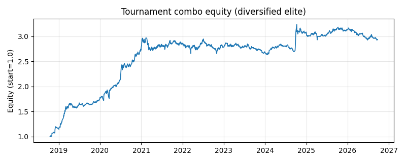

# 策略锦标赛报告 (Tournament Report)

> 数据：ashare_real（38 资产，1930 期）｜ 参与策略：106（失败 0）

对全部策略在同一数据上回测，得到各自收益流，再做**相关性聚类 + 去相关精选 + 分散化组合**，
目的是从众多策略中挑出一组**彼此低相关、各自较优**的「精英组合」，而非只追单一最高夏普。

## 夏普 Top 12
| # | 策略 | 夏普 | 累计 | 波动 | 回撤 | 卡玛 |
|---|---|---|---|---|---|---|
| 1 | `equal_weight_rebal` | 1.15 | 750.2% | 27.6% | 29.1% | 1.11 |
| 2 | `equal_weight_buy_hold` | 1.07 | 1170.7% | 36.2% | 29.8% | 1.32 |
| 3 | `cppi` | 1.07 | 1158.4% | 36.2% | 29.8% | 1.32 |
| 4 | `turn_of_month` | 1.05 | 196.1% | 14.4% | 15.5% | 0.98 |
| 5 | `correlation_regime` | 1.03 | 895.3% | 34.2% | 31.2% | 1.12 |
| 6 | `trend_reversion_blend` | 1.01 | 167.5% | 13.6% | 10.2% | 1.35 |
| 7 | `range_breakout` | 1.00 | 114.9% | 10.5% | 15.3% | 0.69 |
| 8 | `low_beta_timing` | 0.98 | 745.7% | 33.2% | 32.2% | 1.00 |
| 9 | `online_mom_rev_switch` | 0.98 | 218.5% | 16.7% | 20.9% | 0.78 |
| 10 | `inverse_vol_ensemble` | 0.97 | 179.0% | 15.0% | 22.9% | 0.63 |
| 11 | `donchian_turtle` | 0.96 | 135.1% | 12.4% | 15.6% | 0.76 |
| 12 | `risk_parity_alloc` | 0.96 | 674.7% | 32.7% | 30.8% | 0.99 |

## 相关性聚类（6 簇）
按收益相关距离 sqrt(0.5·(1−ρ)) 层次聚类，同簇策略往往捕捉相似逻辑：

- **cluster_1** (2): `momentum_spread_timing`, `residual_momentum_ls`
- **cluster_2** (6): `betting_against_beta`, `group_momentum`, `lowvol_ls`, `quality_ls`, `vol_dispersion_ls`, `xs_momentum_ls`
- **cluster_3** (95): `adaptive_param`, `adx_trend`, `atr_breakout`, `avellaneda_stoikov_proxy`, `bandit_select`, `basket_neutral`, `beta_timing`, `bollinger_breakout`, `bollinger_reversion`, `carry_proxy`, `channel_atr_breakout`, `circuit_breaker`, `clustered_inverse_vol`, `coint_pairs_portfolio`, `correlation_regime`, `cppi`, `crypto_momentum_247`, `dca`, `defensive_quality`, `dispersion_timing`, `donchian_turtle`, `drawdown_averse`, `drawdown_throttle`, `dual_momentum`, `dual_momentum_taa`, `dual_thrust`, `em_regime`, `eof_stat_arb`, `equal_weight_buy_hold`, `equal_weight_ensemble`, `equal_weight_rebal`, `equalweight_composite`, `frog_in_pan`, `gbm_alpha`, `grid_mm_daily`, `grid_trading`, `hedge_experts`, `herc`, `high_52w`, `hrp`, `ic_weighted_composite`, `idio_momentum`, `inventory_skew_mm`, `inverse_vol`, `inverse_vol_ensemble`, `keltner_breakout`, `knn_alpha`, `liquidity_premium`, `liquidity_provision_ls`, `logit_signal`, `low_beta_timing`, `low_volatility`, `ma_deviation`, `ma_ribbon`, `macd_trend`, `max_diversification`, `max_ir_composite`, `min_variance_alloc`, `mom_12m_taa`, `month_of_year`, `online_mom_rev_switch`, `pca_factor`, `portfolio_vol_target`, `range_breakout`, `regime_vol_timing`, `reversal_ls`, `ridge_alpha`, `risk_parity_alloc`, `rsi_reversion`, `sector_neutral_pairs`, `sharpe_weighted_ensemble`, `short_term_reversal`, `sma_cross`, `trailing_stop_overlay`, `trend_quality`, `trend_regime_switch`, `trend_regime_taa`, `trend_reversion_blend`, `ts_momentum`, `tsmom_volscaled`, `turn_of_month`, `turtle_atr`, `vol_managed_momentum`, `vol_regime_filter`, `vol_scaled_momentum`, `vol_target`, `vol_target_taa`, `volatility_breakout`, `volume_imbalance`, `volume_price_divergence`, `vwap_reversion`, `weekday_effect`, `xs_momentum`, `xs_zscore_reversion`, `zscore_reversion`
- **cluster_4** (1): `ssd_pairs`
- **cluster_5** (1): `coint_pairs`
- **cluster_6** (1): `pairs_spread`

## 去相关精选（corr < 0.7，取 8 个）
按夏普降序贪心纳入、跳过与已选高度相关者：
`equal_weight_rebal`, `turn_of_month`, `trend_reversion_blend`, `range_breakout`, `mom_12m_taa`, `em_regime`, `idio_momentum`, `clustered_inverse_vol`

## 精英组合表现（inverse_vol 加权）
- **组合**：累计 193.3% ｜ CAGR 15.1% ｜ 波动 10.8% ｜ 夏普 1.35 ｜ 索提诺 2.37 ｜ 回撤 11.3% ｜ 卡玛 1.34
- 单一最佳（`equal_weight_rebal`）：累计 750.2% ｜ CAGR 32.2% ｜ 波动 27.6% ｜ 夏普 1.15 ｜ 索提诺 1.90 ｜ 回撤 29.1% ｜ 卡玛 1.11
- 等权买入持有基准：累计 1170.7% ｜ CAGR 39.4% ｜ 波动 36.2% ｜ 夏普 1.07 ｜ 索提诺 2.36 ｜ 回撤 29.8% ｜ 卡玛 1.32

组合通过分散化通常能在**相近或更高夏普**下显著**降低回撤**——这正是策略组合的价值。



## 复现
```bash
python examples/run_tournament.py            # 真实数据；或 --synthetic
```
产物：`strategy_returns.csv`、`correlation.csv`、`ranking.csv`、`selection.json`、`combo_equity.*`、本报告。

> 结果为历史数据演示，存在过拟合/幸存者偏差等局限，**不构成投资建议**。
